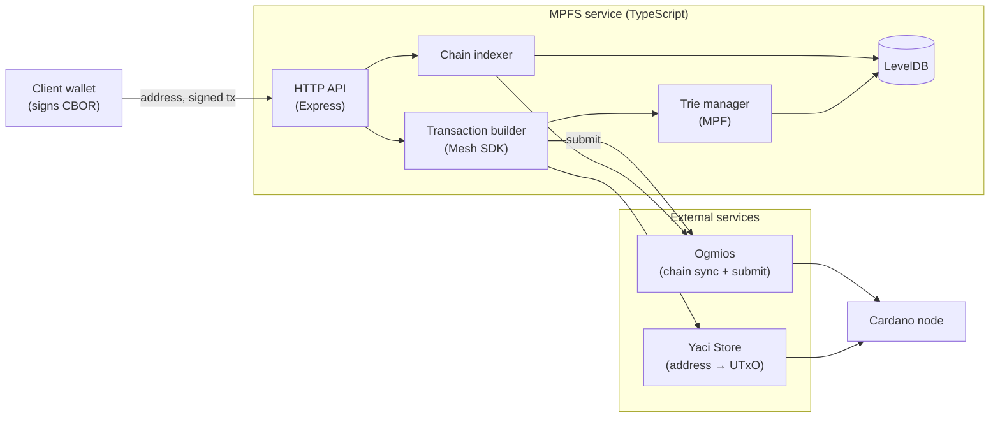

# Merkle Patricia Forestry Service (MPFS)

[](https://cardano-foundation.github.io/mpfs/)
[](LICENSE)

MPFS is a Cardano-native HTTP service for managing verifiable key-value stores
using [Merkle Patricia Forestry](https://github.com/aiken-lang/merkle-patricia-forestry)
(MPF) tries on-chain.

## What is this

A Merkle Patricia Forestry stores key-value pairs (facts) so that anyone can
prove a fact is or is not in the set from a single root hash. MPFS puts that
root hash inside a Cardano UTxO and lets an owner (the *oracle*) evolve it by
accepting change requests from contributors, all under smart-contract
validation. Because every modification appears on-chain, the full history — and
therefore the current facts — is reconstructable by anyone with access to the
chain, and each fact can be referenced as a transaction input in other
contracts.

MPFS bundles three things:

- An **on-chain validator** (Aiken) — the "cage" — that mints MPF tokens and
  validates every `boot`, `update`, `end`, and `retract` operation.
- An **off-chain TypeScript service** that builds the transactions for those
  operations and exposes them over HTTP.
- An **indexer** that follows the chain (via Ogmios) to reconstruct and serve
  the state and facts of every token.

The service is **signingless**: every endpoint returns an *unsigned* CBOR
transaction that the caller signs with their own wallet and submits back. It is
a proof of concept and currently targets Cardano **preprod** only.

## Architecture



## Install

A pre-built image is published to the GitHub Container Registry:

```bash
docker pull ghcr.io/cardano-foundation/mpfs/mpfs:v1.3.0
```

See the [Cardano Foundation deployment guide](https://github.com/cardano-foundation/hal/blob/main/docs/deployment/mpfs/README.md)
for a full `docker-compose` setup (node + Yaci Store + Ogmios + MPFS).

A public preprod instance is hosted at [mpfs.plutimus.com](https://mpfs.plutimus.com)
— free to use, with no availability guarantees. Run your own instance if you
intend to control MPF tokens.

## Quickstart

The service needs a running [Yaci Store](https://github.com/bloxbean/yaci-store)
(address → UTxO mapping) and [Ogmios](https://github.com/cardanoSolutions/ogmios)
(chain events). To run it from source:

```bash
git clone https://github.com/cardano-foundation/mpfs
cd mpfs/off_chain
npm install
npx tsx src/service/signingless/main.ts --port 3000 \
    --provider yaci --yaci-store-host http://localhost:8080 \
    --ogmios-host http://localhost:1337 \
    --database-path ./mpfs.db \
    --since-slot 94898393 \
    --since-block-id ef94934f8eb129ebf07eeaab007b81ecb1bc58b121d19ac0ffe81f928bf56cc
```

`--since-slot` / `--since-block-id` set where indexing starts; start from a
point *before* the token you care about was created (for a fresh token, "now"
is fine). See the [Getting Started guide](https://cardano-foundation.github.io/mpfs/getting-started/)
for the full option list and a Docker-based setup.

## Usage

Every transaction endpoint returns an unsigned CBOR transaction under
`unsignedTransaction`; sign it with your wallet and submit it back via
`POST /transaction`. Request bodies follow the on-chain operation: insert takes
`newValue`, delete takes `oldValue`, update takes both.

| Endpoint | Method | Description |
|----------|--------|-------------|
| `/tokens` | GET | List all MPF tokens |
| `/token/{tokenId}` | GET | Token state and pending requests |
| `/token/{tokenId}/facts` | GET | All facts stored in a token |
| `/config` | GET | Cage script address, policy id, blueprint |
| `/transaction/{address}/boot-token` | GET | Build a tx to create a new token |
| `/transaction/{address}/request-insert/{tokenId}` | POST | Request to insert a fact (`{key, newValue}`) |
| `/transaction/{address}/request-delete/{tokenId}` | POST | Request to delete a fact (`{key, oldValue}`) |
| `/transaction/{address}/request-update/{tokenId}` | POST | Request to update a fact (`{key, oldValue, newValue}`) |
| `/transaction/{address}/update-token/{tokenId}` | GET | Process pending requests |
| `/transaction/{address}/retract-change/{requestId}` | GET | Retract a pending request |
| `/transaction/{address}/end-token/{tokenId}` | GET | Destroy a token |
| `/transaction` | POST | Submit a signed transaction |

The full surface, with worked end-to-end examples, is in the
[Signingless Manual](https://cardano-foundation.github.io/mpfs/manual/signingless/)
and the live Swagger UI at [mpfs.plutimus.com/api-docs](https://mpfs.plutimus.com/api-docs).

## Documentation

Full documentation is published at
[cardano-foundation.github.io/mpfs](https://cardano-foundation.github.io/mpfs/).

For AI agents, start at [AGENTS.md](AGENTS.md).

## Development

The Nix dev shell provides Node.js/npm, Aiken, the Cardano node/CLI tooling,
Yaci CLI, and mkdocs:

```bash
nix develop
```

Common tasks are driven through [`just`](justfile):

```bash
just build-on-chain     # aiken build
just check-on-chain     # aiken check
just build-off-chain    # copy plutus.json into off_chain, npm install
just test-all           # run the off-chain test suite (needs Yaci + Ogmios)
```

Build the docs site locally:

```bash
nix develop
mkdocs serve   # then open http://localhost:8000
```

## Project Structure

```
mpfs/
├── on_chain/              # Aiken smart contract (the "cage")
│   └── validators/        # cage.ak, types.ak, lib.ak
├── off_chain/             # TypeScript service
│   └── src/
│       ├── service/       # HTTP API (signingless), wallet + cli helpers
│       ├── transactions/  # boot / request / update / retract / end builders
│       ├── indexer/       # Ogmios-driven chain indexer + state
│       ├── trie/          # MPF trie management and proofs
│       └── mpf/           # vendored Merkle Patricia Forestry library
├── docs-mkdocs/           # documentation site (mkdocs, built by CI)
├── flake.nix              # Nix development environment
└── justfile               # task runner
```

## Dependencies

- [Yaci Store](https://github.com/bloxbean/yaci-store) — address to UTxO mapping
- [Ogmios](https://github.com/cardanoSolutions/ogmios) — chain event tracking and submission
- [Cardano Node](https://github.com/intersectMBO/cardano-node) — blockchain access

## See Also

- [HAL - Cardano Foundation](https://github.com/cardano-foundation/hal)
- [Merkle Patricia Forestry Library](https://github.com/aiken-lang/merkle-patricia-forestry)
- [Cardano Foundation](https://github.com/cardano-foundation)
- [About Cardano](https://cardano.org/)
- Decentralized code tracking on [Radicle](https://radicle.xyz/): [rad:zpZ4szHxvnyVyDiy2acfcVEzxza9](https://app.radicle.xyz/nodes/seed.radicle.garden/rad:zpZ4szHxvnyVyDiy2acfcVEzxza9)

## License

Apache 2.0 — see [LICENSE](LICENSE).
