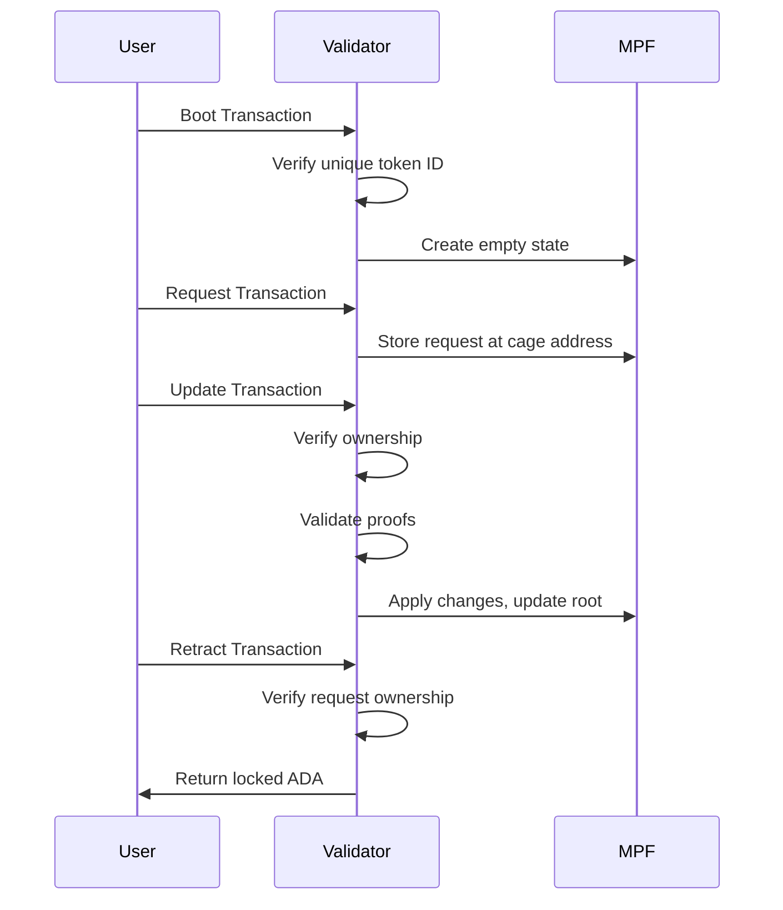

# On-chain Code Documentation

The on-chain component is written in [Aiken](https://aiken-lang.org/), a functional programming language designed for Cardano smart contracts.

## Overview

The cage smart contract manages MPF (Merkle Patricia Forestry) tokens on Cardano. It implements a "caging" pattern where tokens are locked at a script address with their MPF root stored in the datum.

## Module Structure

### `types.ak`

Defines the core data types used throughout the contract:

#### `Mint`
Parameters for minting a new caged token. The `asset` output reference must be
one of the transaction inputs; its hash becomes the token's asset name,
guaranteeing uniqueness:
```aiken
type Mint {
  asset: OutputReference,
}
```

#### `MintRedeemer`
Redeemer for the minting policy:
```aiken
type MintRedeemer {
  Minting(Mint)  // Mint a new caged token
  Burning        // Burn an existing caged token (no extra validation)
}
```

#### `UpdateRedeemer`
Redeemer for spending caged UTxOs. The available action depends on whether the
UTxO carries a `State` or a `Request` datum (constructor order matters — it is
the on-chain `ConStr` index):
```aiken
type UpdateRedeemer {
  End                       // ConStr0: destroy the caged token (State datum)
  Contribute(OutputReference) // ConStr1: link a request to a State UTxO (Request datum)
  Modify(List<Proof>)       // ConStr2: fold requests into the MPF (State datum)
  Retract                   // ConStr3: reclaim a Request UTxO (Request datum)
}
```

#### `State`
The state of a caged token, stored as an inline datum:
```aiken
type State {
  owner: VerificationKeyHash,  // Public key hash of the owner
  root: ByteArray,             // Current MPF root hash
}
```

#### `Operation`
The operations that can be applied to the MPF. Variants are positional:
```aiken
type Operation {
  Insert(ByteArray)            // new value
  Delete(ByteArray)            // expected (old) value
  Update(ByteArray, ByteArray) // (old_value, new_value)
}
```

#### `Request`
A pending modification request:
```aiken
type Request {
  requestToken: TokenId,            // Target token (by asset name)
  requestOwner: VerificationKeyHash, // Request owner (can Retract)
  requestKey: ByteArray,            // MPF key to modify
  requestValue: Operation,          // The requested operation
}
```

#### `CageDatum`
The datum type for UTxOs at the cage address. Variants are positional:
```aiken
type CageDatum {
  RequestDatum(Request)  // A pending request
  StateDatum(State)      // Token state
}
```

### `lib.ak`

Helper functions for token handling. `TokenId` is defined here as a wrapper
around an `AssetName`:

#### `quantity(policyId: PolicyId, value: Value, TokenId) -> Option<Int>`
Returns the quantity of the given token in a value, or `None` if absent.

#### `assetName(ref: OutputReference) -> Hash<Sha2_256, OutputReference>`
Computes a unique asset name as the SHA2-256 hash of the transaction id
concatenated with the output index (2 big-endian bytes).

#### `valueFromToken(policyId: PolicyId, TokenId) -> Value`
Constructs a value holding exactly one of the given token.

#### `tokenFromValue(value: Value) -> Option<TokenId>`
Extracts the single non-ADA token from a value, or `None` if it does not hold
exactly one policy with exactly one asset name.

#### `extractTokenFromInputs(what: OutputReference, inputs: List<Input>)`
Finds the input matching the output reference and extracts its single token.

### `cage.ak`

The main validator implementing both minting policy and spending validator.

## Minting Policy

The minting policy controls token creation and destruction:

### `Minting` (boot)
When creating a new token:
1. The token ID must be unique (derived from a spent UTxO)
2. Exactly one token is minted
3. A new State UTxO is created at the cage address with:
   - The minted token
   - A null (empty) MPF root
   - The signer as the owner

### `Burning` (end)
When destroying a token:
1. The token is burned (quantity: -1)
2. No additional validation runs in the minting policy; the spending validator's
   `End` case enforces owner signature when the State UTxO is consumed

## Spending Validator

The spending validator handles four cases based on the redeemer:

### End (ConStr0)
Terminates the token:
- Validates ownership
- Token is burned via the minting policy

### Contribute (ConStr1)
Spends a request UTxO in an update transaction:
- Verifies the referenced state UTxO is being consumed
- Part of batch request processing

### Modify (ConStr2)
Updates the MPF state:
- Validates ownership
- Verifies all proofs match the requests being consumed
- Computes the new root from applied operations
- Ensures the output contains the updated state

### Retract (ConStr3)
Allows request owners to reclaim their request UTxOs:
- Only the request owner can retract
- Returns the locked ADA

## Validation Flow



## Security Properties

1. **Ownership**: Only the token owner can modify or destroy the token
2. **Integrity**: All MPF modifications include cryptographic proofs
3. **Uniqueness**: Token IDs are derived from spent UTxOs, ensuring uniqueness
4. **Retractability**: Request owners can always reclaim their pending requests
